# pstn-callrecord-plan-alerts

  

.NET Framework

# Overview 

* A .net core console application to compare total pstn call minutes to calling plan limits

# Setup

1. Fork Repo

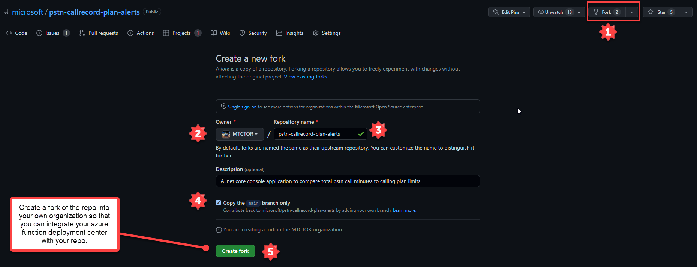 

2. App Registration Creation

    - Create a new App Registration in AAD and select "Web" for the Redirect URI and leave the value empty. Click "Register"
    - Create a Client Secret and give it a period of your choosing
    - Make the below modifications to support oAuth Flowtype and permissions required:

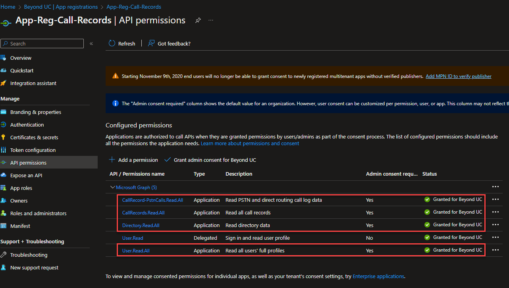 

 

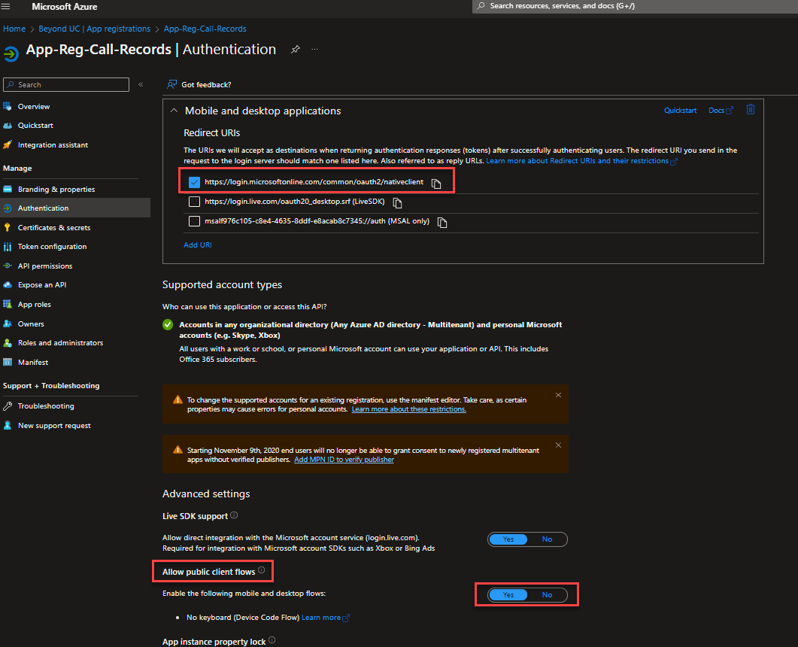 

1. Create Resource Group

    navigate to http://portal.azure.com and Create a Resource Group in the appropriate region

    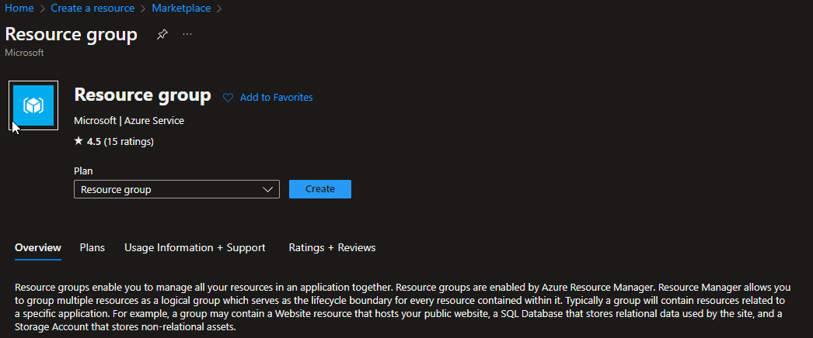 

2. Create Azure Function

    Select the Market place template for Function App
    
    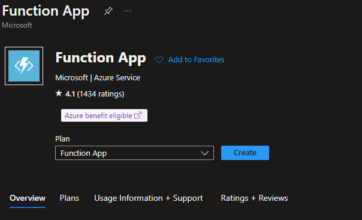 

    Create an Azure function with the following properties:
    - Publish: Code
    - Runtime Stack: .NET
    - Version: 6
    - Operating System: Windows
    - Plan type: Comsumption (Serverless)
  
    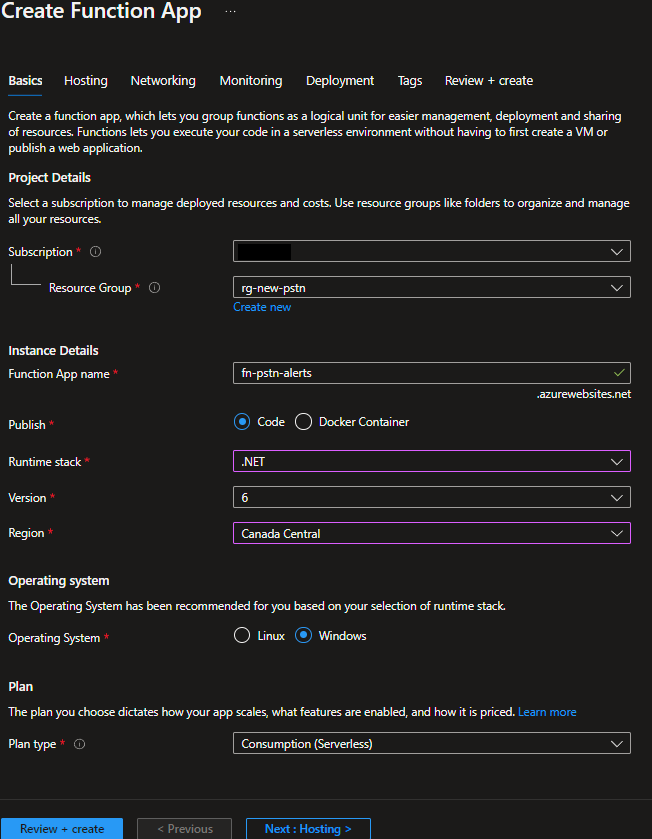 
    
    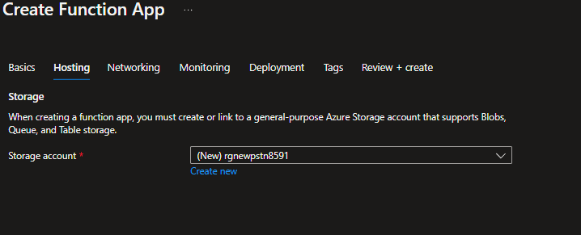 
    
    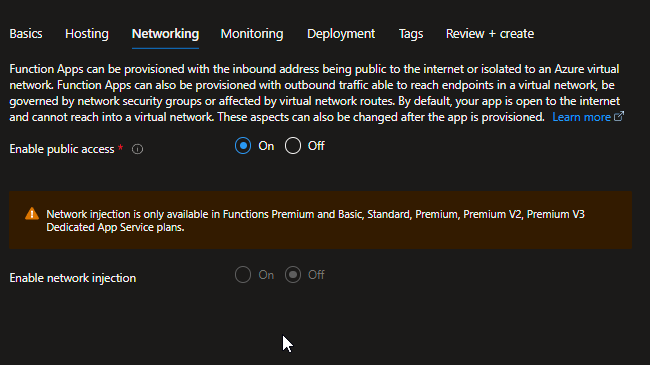 
    
    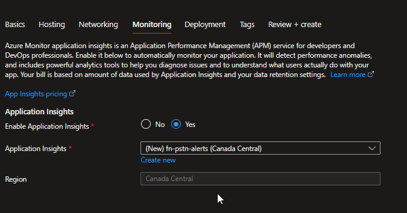 

3. Configuration

    Navigate to the Function App-->Settings-->Configuration
    
    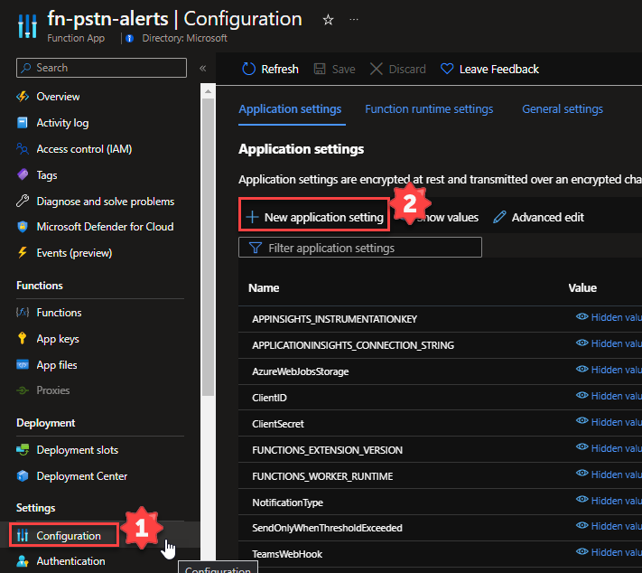 

    Add the following App Configuration settings

    - Name: TenantID, Value: [TENANT ID OF YOUR APP REGISTRATION CREATED EARLIER]
    - Name: ClientID, Value: [CLIENT ID OF YOUR APP REGISTRATION CREATED EARLIER]
    - Name: ClientSecret, Value: [ClientSecret OF YOUR APP REGISTRATION CREATED EARLIER]
    - Name: TeamsWebHook, Value: [INCOMING WEBHOOK URI TO ACCEPT NOTIFICATION]
    - Name: ThresholdLimit, Value: [THRESHOLD WHEN CLOSE TO PLAN LIMIT, DEFAULT IS 80 FOR 80%]
    - Name: NotificationType, Value: [HOW TO BE NOTIFIED: Teams, Console, or ALL]
    - Name: SendOnlyWhenThresholdExceeded, Value: [true or false]
    - Name: CronTimerSchedule, Value: [a CRON syntax string to run the function, Default setting is every 10 minutes for testing. please change this to once a day ]
      - Some example values:
        - 0 */10 * * * * = Once every 10 Minutes
        - 0 */1 * * * * = Once every Minute
        - 0 0 22 * * * = Once every day at 10:00PM
     
# Run

Restart the function once the configuration has completed. you can do so at the Function App-->Overview Page:

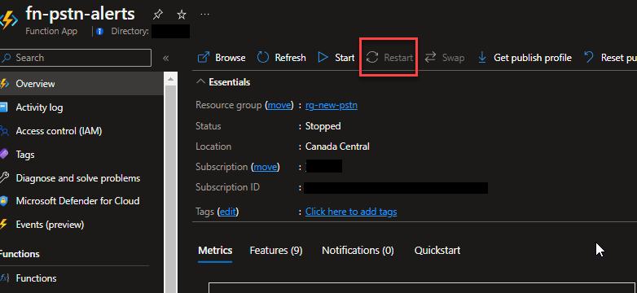 

You can view the log tail by navigating to Function App-->Monitoring-->Log Stream and click "start":

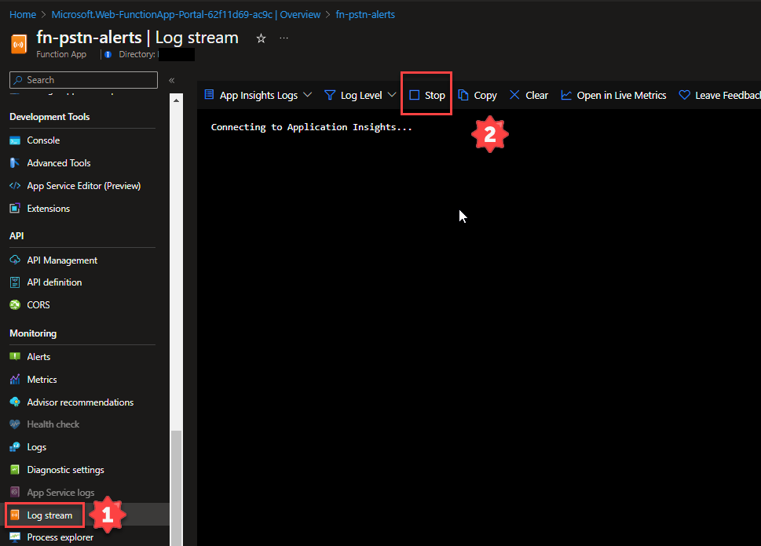 

Check for errors. 

Done: You should see Console Information showing in the Log Stream as Well as Teams Messages in the channel you setup your incoming webhook if all is correct!

# Build / Debug

```bash

git clone https://github.com/microsoft/pstn-callrecord-plan-alerts.git

[C#]
dotnet build
func start


```
## Contributing

This project welcomes contributions and suggestions.  Most contributions require you to agree to a
Contributor License Agreement (CLA) declaring that you have the right to, and actually do, grant us
the rights to use your contribution. For details, visit https://cla.opensource.microsoft.com.

When you submit a pull request, a CLA bot will automatically determine whether you need to provide
a CLA and decorate the PR appropriately (e.g., status check, comment). Simply follow the instructions
provided by the bot. You will only need to do this once across all repos using our CLA.

This project has adopted the [Microsoft Open Source Code of Conduct](https://opensource.microsoft.com/codeofconduct/).
For more information see the [Code of Conduct FAQ](https://opensource.microsoft.com/codeofconduct/faq/) or
contact [opencode@microsoft.com](mailto:opencode@microsoft.com) with any additional questions or comments.

## Trademarks

This project may contain trademarks or logos for projects, products, or services. Authorized use of Microsoft 
trademarks or logos is subject to and must follow 
[Microsoft's Trademark & Brand Guidelines](https://www.microsoft.com/en-us/legal/intellectualproperty/trademarks/usage/general).
Use of Microsoft trademarks or logos in modified versions of this project must not cause confusion or imply Microsoft sponsorship.
Any use of third-party trademarks or logos are subject to those third-party's policies.

# Notes

**Call Plan Limits and Configuration Settings**

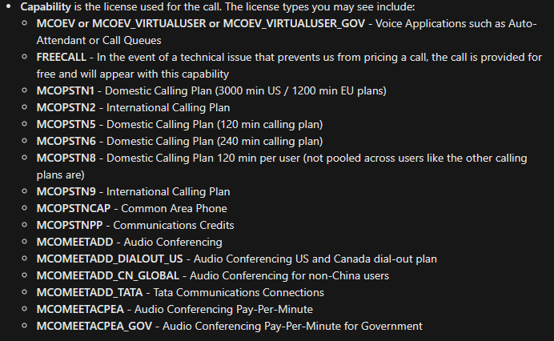 

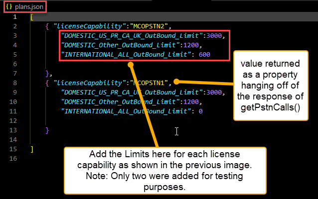 

Quick links:

**MS Graph API Call(s)**
- [callRecord: getPstnCalls](https://learn.microsoft.com/en-us/graph/api/callrecords-callrecord-getpstncalls?view=graph-rest-1.0&tabs=http)


## Where do I file issues

This is the correct repo to file [issues](https://github.com/microsoft/pstn-callrecord-plan-alerts/issues)


## Contribute

We enthusiastically welcome contributions and feedback. You can clone the repo and start contributing now. Read our [Contribution Guide](contributing.md) for more information.

This project has adopted the [Microsoft Open Source Code of Conduct](https://opensource.microsoft.com/codeofconduct/). For more information see the [Code of Conduct FAQ](https://opensource.microsoft.com/codeofconduct/faq/) or contact [opencode@microsoft.com](mailto:opencode@microsoft.com) with any additional questions or comments.

## Security Library

This library controls how users sign-in and access services. We recommend you always take the latest version of our library in your app when possible. We use [semantic versioning](http://semver.org) so you can control the risk associated with updating your app. As an example, always downloading the latest minor version number (e.g. x.*y*.z) ensures you get the latest security and feature enhancements but our API surface remains the same. You can always see the latest version and release notes under the Releases tab of GitHub.

## Security Reporting

If you find a security issue with our libraries or services please report it to [secure@microsoft.com](mailto:secure@microsoft.com) with as much detail as possible. Your submission may be eligible for a bounty through the [Microsoft Bounty](http://aka.ms/bugbounty) program. Please do not post security issues to GitHub Issues or any other public site. We will contact you shortly upon receiving the information. We encourage you to get notifications of when security incidents occur by visiting [this page](https://technet.microsoft.com/en-us/security/dd252948) and subscribing to Security Advisory Alerts.

## Data Collection. 

The software may collect information about you and your use of the software and send it to Microsoft. Microsoft may use this information to provide services and improve our products and services. You may turn off the telemetry as described in the repository. There are also some features in the software that may enable you and Microsoft to collect data from users of your applications. If you use these features, you must comply with applicable law, including providing appropriate notices to users of your applications together with a copy of Microsoft's privacy statement. Our privacy statement is located at https://go.microsoft.com/fwlink/?LinkID=824704. You can learn more about data collection and use in the help documentation and our privacy statement. Your use of the software operates as your consent to these practices.

See the [wiki](https://github.com/AzureAD/microsoft-authentication-library-for-dotnet/wiki/MSAL.NET-telemetry-solution-overview) for an example of the telemetry collected by MSAL.NET.

## Trademarks.

This project may contain trademarks or logos for projects, products, or services. Authorized use of Microsoft trademarks or logos is subject to and must follow [Microsoft's Trademark & Brand Guidelines](https://www.microsoft.com/en-us/legal/intellectualproperty/trademarks/usage/general). Use of Microsoft trademarks or logos in modified versions of this project must not cause confusion or imply Microsoft sponsorship. Any use of third-party trademarks or logos are subject to those third-party's policies.

Copyright (c) Microsoft Corporation.  All rights reserved. Licensed under the MIT License (the "License");
